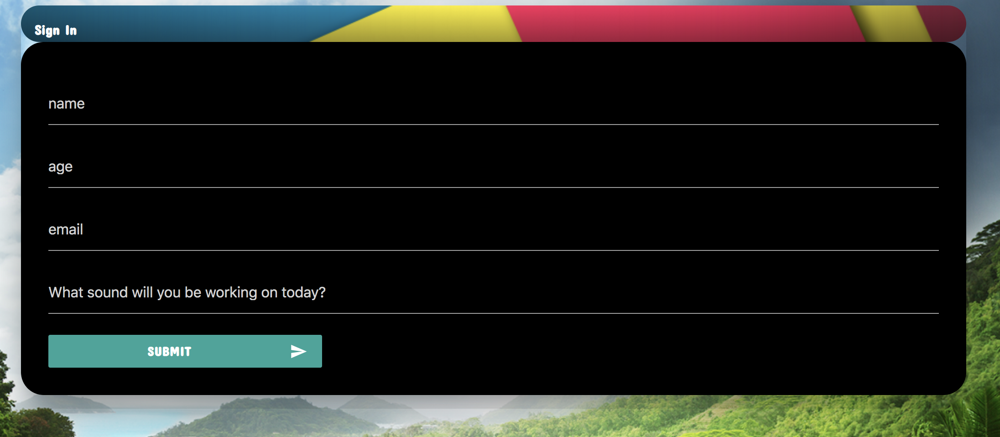

# Speech Sounds Fun Practice
Articulation Teletherapy

Full Stack Group Project 1 created during KU Coding Bootcamp. The user may click on the group of sounds from the menu to work on then click through the carousel of animals. Once an animal is clicked, a Gif, viseme (mouth representation of the sound), and a prompt to repeat the text-to-speech will appear. 

## Screen Shots

Main user screen 

Drop down sign in form that sends to firebase.

Screen shots of prompts that appear when animals are clicked. 

## Technologies used
- Google Fonts
- Materialize
- jQuery
- Javascript
- Firebase
- Web API

## Acknowledgments
Thanks to group members for additional help on this project. 
- Jomar Yokey
- James Bramble
- Robert Martin